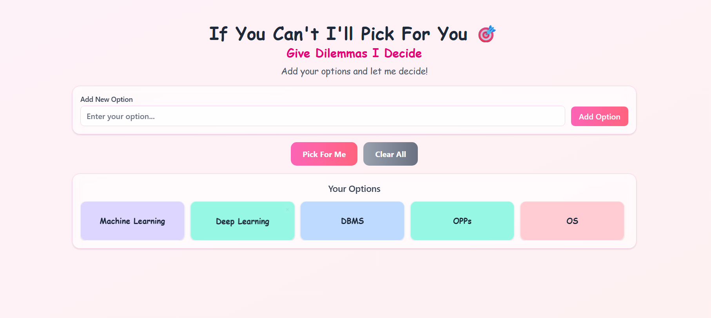
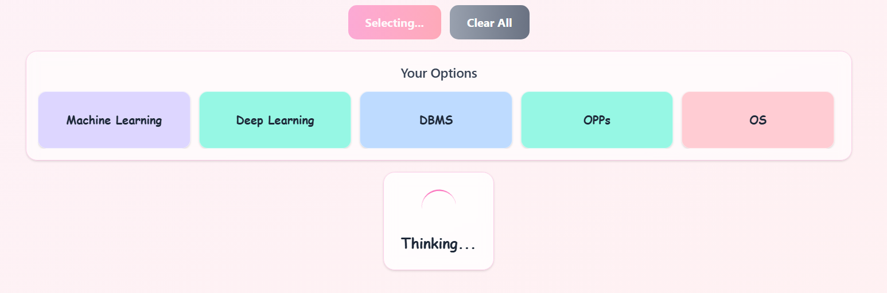
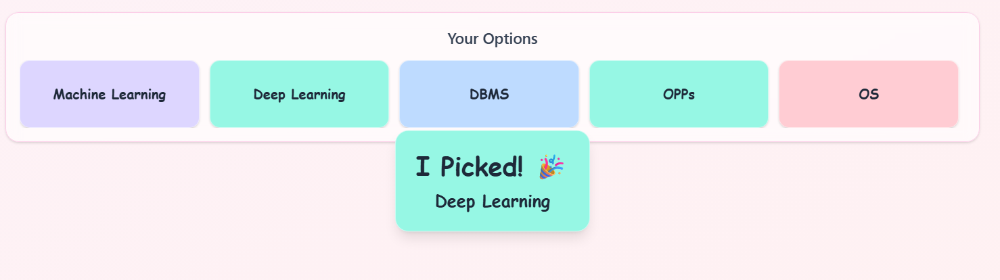

# 🎯 Give Dilemmas I Decide

> **Can't decide? Let this app pick for you!** Add your options, click "Pick For Me", and watch as the app randomly selects one with a fun animated interface.

## ✨ Features

- **🎲 Random Selection**: Add multiple options and let the app randomly pick one for you
- **🎨 Beautiful UI**: Modern, responsive design with a playful Comic Sans MS font
- **🌈 Colorful Cards**: Each option gets a random pastel color for visual appeal
- **📱 Single Screen Layout**: Everything fits on one screen - no scrolling required
- **🔄 Animated Selection**: Enjoy a 2-second "thinking" animation before the result
- **📱 Responsive Design**: Works perfectly on desktop, tablet, and mobile
- **🎭 Fun Interactions**: Hover effects, smooth transitions, and engaging animations

## 🚀 Live Demo

[Try the app here!](https://give-dilemmas-i-decide.vercel.app/)

## 🖼️ Screenshots

### Main Interface

*Clean, single-screen layout with colorful option cards*

### Selection Animation

*Fun "thinking" animation while the app makes its decision*

### Result Display

*Celebratory display of the randomly selected option*

## 🛠️ Built With

- **React 18** - Modern React with hooks
- **Tailwind CSS** - Utility-first CSS framework
- **Vite** - Fast build tool and dev server
- **Comic Sans MS** - Fun, readable typography
- **Responsive Grid** - Adaptive layout for all screen sizes

## 🎯 How It Works

1. **Add Options**: Type your choices in the input field and click "Add Option"
2. **Review Choices**: See all your options displayed as colorful rectangular cards
3. **Get Decision**: Click "Pick For Me" and watch the animated selection process
4. **See Result**: The app reveals your randomly selected option with celebration!

## 🚀 Getting Started

### Prerequisites
- Node.js (version 16 or higher)
- npm or yarn package manager

### Installation

1. **Clone the repository**
   ```bash
   git clone https://github.com/anushtha-singh/give-dilemmas-i-decide.git
   cd give-dilemmas-i-decide
   ```

2. **Install dependencies**
   ```bash
   npm install
   ```

3. **Start the development server**
   ```bash
   npm run dev
   ```

4. **Open your browser**
   Navigate to `http://localhost:5173` to see the app in action!

### Build for Production

```bash
npm run build
```

The built files will be in the `dist` folder, ready for deployment.

## 🎨 Customization

### Changing Colors
The app uses Tailwind CSS color classes. You can modify the `colorOptions` array in `src/App.jsx`:

```javascript
const colorOptions = [
  "bg-pink-200", "bg-blue-200", "bg-green-200", 
  "bg-yellow-200", "bg-purple-200", "bg-indigo-200"
  // Add or change colors here
];
```

### Modifying Fonts
The app uses Comic Sans MS for a fun appearance. You can change this by updating the `font-['Comic_Sans_MS']` classes throughout the code.

### Adjusting Layout
The single-screen layout is achieved through careful spacing. Modify the `max-h-48` class on the cards container to adjust the scrollable height.

## 📱 Responsive Design

The app automatically adapts to different screen sizes:
- **Mobile**: 5 columns of cards
- **Small screens**: 3 columns
- **Medium screens**: 4 columns  
- **Large screens**: 5 columns
- **Extra large**: 6 columns

## 🎭 Key Features Explained

### Single Screen Layout
- All content fits within the viewport height
- Cards container has a fixed height with scrollable overflow
- No page scrolling required

### Rectangular Cards
- Cards use `h-20 w-full` for optimal text display
- Better readability than square cards
- Responsive grid system adapts to content

### Fun Typography
- Comic Sans MS font throughout for playful appearance
- Large, readable text sizes
- Consistent font usage across all elements

## 🤝 Contributing

1. Fork the repository
2. Create a feature branch (`git checkout -b feature/AmazingFeature`)
3. Commit your changes (`git commit -m 'Add some AmazingFeature'`)
4. Push to the branch (`git push origin feature/AmazingFeature`)
5. Open a Pull Request

## 🙏 Acknowledgments

- **Tailwind CSS** for the utility-first CSS approach
- **Vite** for the fast build tooling
- **Comic Sans MS** for the fun typography (controversial but effective!)

⭐ **Star this repository if you found it helpful!**

Made with ❤️ and lots of indecision
